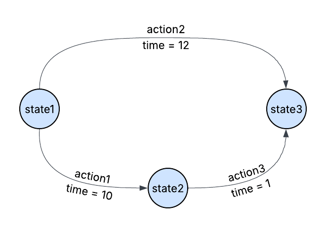

# Time-optimal path planning

## Description

This repository contains a path planning algorithm based on Dijkstra's method. 

#### Objective: Calculate the shortest time path for a robot between the given start and end states.

The problem of time-optimal path planning can be cast as a search problem on a weighted directed acyclic graph, where
* The states are vertices in a graph,
* The possible actions are edges between the vertices,
* The weights (cost) on the edges are times associated with taking the action associated with the edge.

Finding the time-optimal path is then similar to finding the least cost path on the graph (see Section 2.3.1 in Reference [1]).

In the directed acyclic graph (DAG) below, the start state is `state1` and the end state is `state2`. The actions `action1` and `action3` together give the least-time path.



The version of Dijkstra's algorithm presented in this repository makes the following assumptions about the data being provided:

* There exists at least one path from the start state to the end state.
* The time associated with  each action is non-negative (>= 0). 
* The total cost associated with the optimal path can be accommodated in a `uint32_t` data type.

The above assumptions can be relaxed easily.

## Overview of the algorithm

The general flow of the algorithm is as follows:

* Step 1: Begin at the start node.
* Step 2: For each node, calculate the time to go to each of its neighbour nodes in the graph.
* Step 3: Update the cost of each neighbour with the time to go if the current time to go is larger. Also, store the name of the neighbour with the smallest time.
* Step 4: Push the neighbours on a priority queue, where neighbours are sorted based on the time to reach them.
* Step 5: Select the neighbour with the smallest time (or cost-to-go).
* Step 6: If end node reached, terminate; else go to Step 1.

The optimal path can then be read from the queue that stores the lowest cost neighbours.

More details on the algorithm can be found at the following reference.

## References

[1] LaValle, S. M. (2006). Planning algorithms. _Planning Algorithms_, _9780521862_, 1–826. [https://doi.org/10.1017/CBO9780511546877](https://doi.org/10.1017/CBO9780511546877)

## Compiling and Running code

### Installing dependendcies

NOTE: The package has been developed and tested in a Linux-based (Ubuntu 24.04 and Ubuntu 18.04) operating system. Support for Windows and macOS does not exist.

The main requirements are `wget`, `cmake`, and `git`, which can be installed as follows

```bash
sudo apt install cmake
sudo apt install git
sudo apt install wget
```

Note that running the cmake command requires an active internet connection to download JSON realted header file. Additionally, it is assumed that the host environment supports the c++14 standard.


### Clone the repository

```bash
git clone https://github.com/abhigoudar/opt_path_search.git
```

NOTE: If CMake is unable to download the JSON file from GitHub archives, please switch to the **json branch** that has the necessary files.

### Build

The following instructions assume that the repository was cloned in the `/home/$USER` directory. If the repository is cloned in a custom location, please execute the commands in the repository's main directory.

```bash
cd ~/opt_path_search
mkdir build && cd build
cmake ..
make
```

This should produce a binary file called `plan_shortest_time` in the `build` directory.

### Running the algorithm

The repository contains representative examples in the `data` directory. The command line instruction for testing the algorithm is as follows:

```bash
./plan_shortest_time <problem JSON file> <states JSON file> <actions JSON file>
```

where 

* `<problem JSON file>` is a JSON file containing the start and goal states. 

* `<states JSON file>` is a JSON file containing all the possible states. 

* `<actions JSON file>` is a JSON file containing all the actions, the corresponding start and end states, and the time associated with taking each action.


The exact format can be found in the `problem_dummy` directory.


Example: 
```c++
cd ~/opt_path_search/build
./plan_shortest_time ../data/problem_dummy/problem.json ../data/problem_dummy/states.json ../data/problem_dummy/actions.json
```

This should produce the following output

```bash

 Done calculating the shortest path 

-->state1-->state2-->state3


 Optimal action list (end to start) 

-->action1-->action3

 ----------- Total time of shortest path: 11

 Writing optimal action list to: ../data/problem_dummy/optimal_actions.json

```

As noted in the above snippet, running the algorithm will produce an `optimal_actions.json` file containing the list of actions to take from `start_state` to `end_state` that incur the least time, which is also included in the output JSON file.

